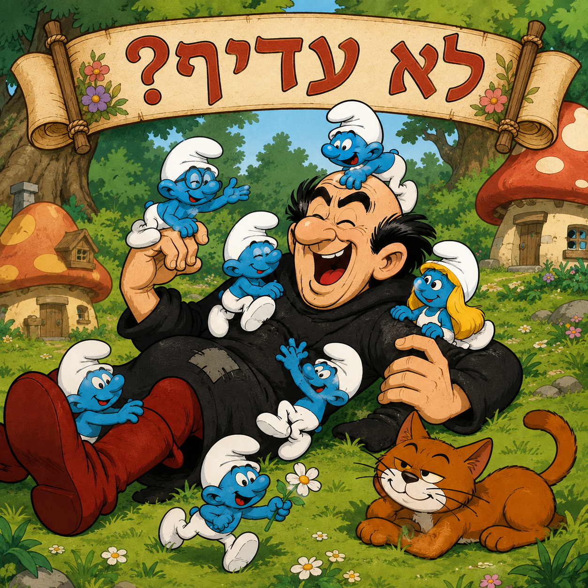
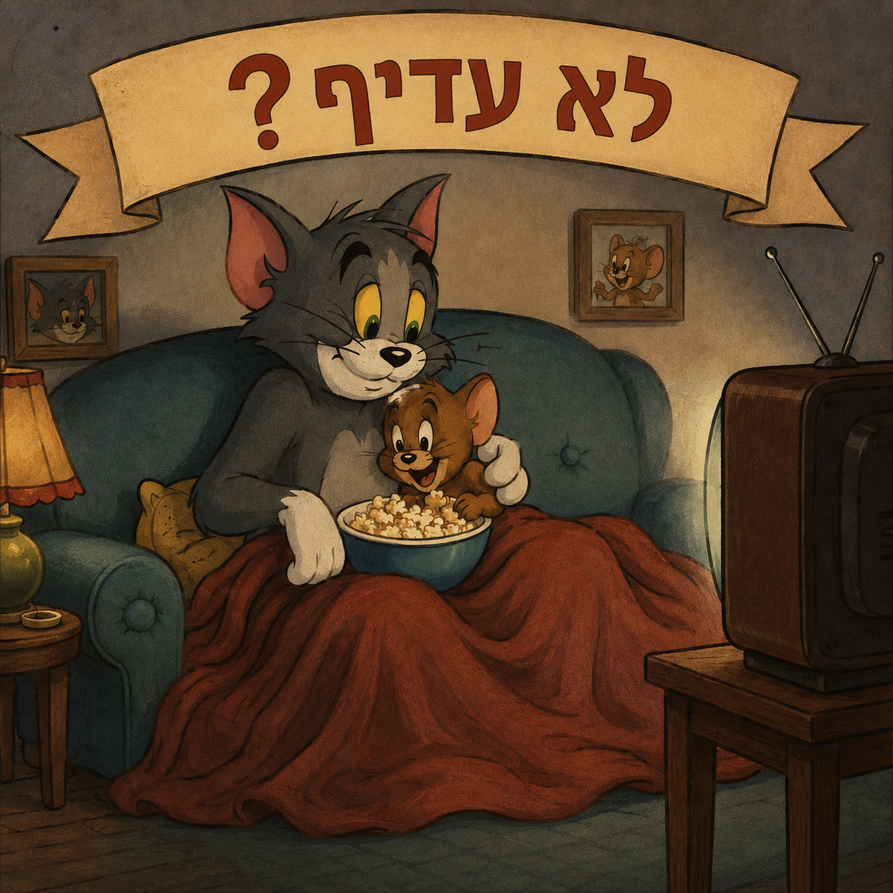
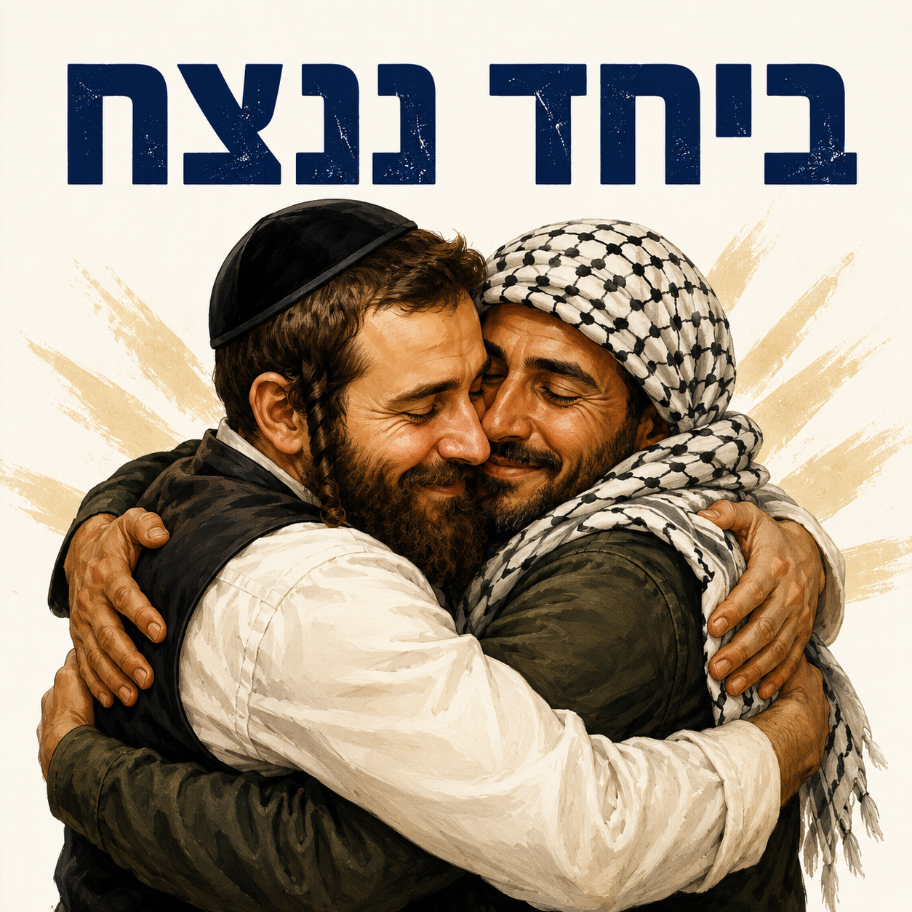
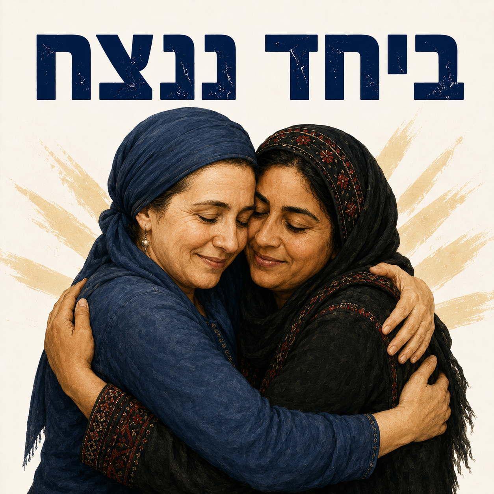

# visions_of_peace

Art for peace: free images imagining “enemies” sharing humanity, joy, and coexistence.

This project imagines people cast as enemies — Israelis and Palestinians, or even iconic rivals from animation — sharing joy, friendship, and tenderness instead of fear and hatred.

These images are free to download, share, and adapt under the custom **Peace Use License** in [LICENSE](LICENSE).

In short:
- you may use, repost, print, remix, and share the images freely
- please give attribution where practical
- you may **not** use them to promote hatred, violence, dehumanization, discrimination, or war propaganda

This is a **custom license** created for this project, not a standard open-source or Creative Commons license.

## Contribute

Contributions are warmly welcome from anyone who wants to create in the same spirit.

You can contribute:
- new images or visual variations
- translations of captions or text
- posters, stickers, or printable versions
- remixes or adaptations that deepen the message of peace, dignity, and coexistence

If you contribute, please keep the work aligned with the values of this project: empathy, nonviolence, shared humanity, and respect for all people.

## Images

